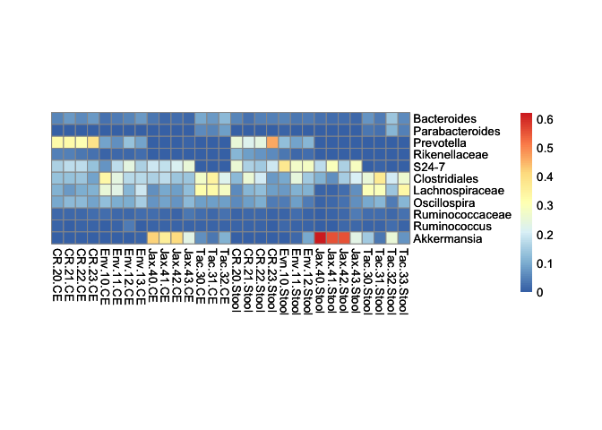
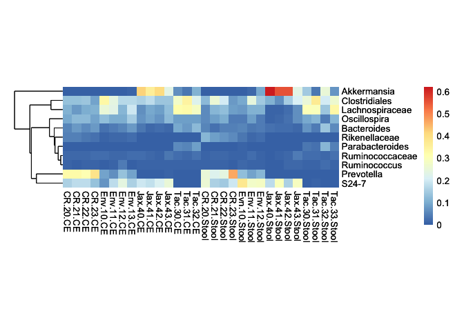
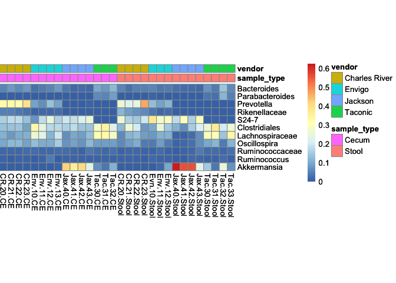
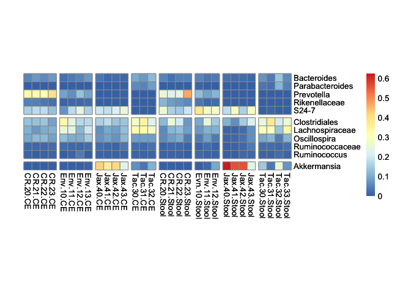
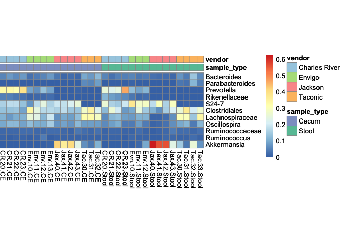
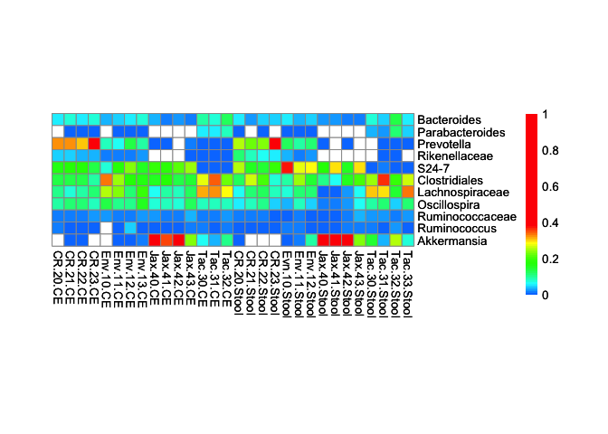

<!-- README.md is generated from README.Rmd. Please edit that file -->

# pheatbuilder

This package provides a stepwise, pipe-friendly interface to create
heatmaps in R.

## Installation

You can install pheatbuilder from github with:

``` r
# install.packages("devtools")
devtools::install_github("kylebittinger/pheatbuilder")
```

## Making heatmaps with pheatbuilder

The pheatbuilder package comes with a built-in dataset, `vendor_props`.
This data matrix contains bacterial taxon proportions in cecal and fecal
samples in mice from four different vendors.

Heatmaps start by passing a matrix or data frame to the `pheat`
function. By default, the cells of the heatmap are 10pt square (matching
the default font size), and the rows/columns are not clustered.

``` r
pheat(vendor_props)
```

<!-- -->

To adjust the heatmap, additional functions can be chained. Let’s
cluster the rows and remove the cell borders.

``` r
library(magrittr)
vendor_props %>%
  pheat() %>%
  pheat_cluster_rows() %>%
  pheat_display_main(border_color = NA)
```

<!-- -->

If you have data frames with additional info for the rows and columns,
thse can be added as annotations to the heatmap. The data frame
`vendor_samples` has info about the sample types and vendors.

``` r
head(vendor_samples)
```

    ##   sample_id sample_type         vendor
    ## 1  CR.20.CE       Cecum Charles River 
    ## 2  CR.21.CE       Cecum Charles River 
    ## 3  CR.22.CE       Cecum Charles River 
    ## 4  CR.23.CE       Cecum Charles River 
    ## 5 Env.10.CE       Cecum         Envigo
    ## 6 Env.11.CE       Cecum         Envigo

By default, values in the first column are used to match to the heatmap
grid.

``` r
vendor_props %>%
  pheat() %>%
  pheat_annotate_cols(vendor_samples)
```

<!-- -->

Heatmaps can be saved with a call to `pheat_save`. If the height and
width are not set, the document is automatically sized to fit the
heatmap.

``` r
vendor_props %>%
  pheat() %>%
  pheat_save("vendor_heatmap.pdf")
```

The function `pheat_save` returns the heatmap invisibly. If you still
want to see the heatmap on screen after it is saved to a file, you can
add `print` to the chain of functions at the end.

## Convenience functions for gaps and color palettes

Sometimes it’s nice to have gaps between rows or columns of the heatmap.
The gap locations are typically specified with row or column numbers,
after which the gaps are to appear. As a convenience, we provide the
`factor_gaps` function to generate gap locations automatically based on
a factor or character vector.

For example, we can create a vector of gap locations for the mouse
vendor.

``` r
factor_gaps(vendor_samples$vendor)
```

    ## [1]  4  8 12 15 19 22 26

And here is a vector of gaps between bacterial phyla.

``` r
factor_gaps(vendor_taxa$phylum)
```

    ## [1]  5 10

Putting these both in the plot, we can add gaps in the rows and columns.

``` r
vendor_props %>%
  pheat() %>%
  pheat_display_cols(gaps = factor_gaps(vendor_samples$vendor)) %>%
  pheat_display_rows(gaps = factor_gaps(vendor_taxa$phylum))
```

<!-- -->

One trouble spot with annotated heatmaps is setting the color palettes
for various annotations. The function `factor_palette` allows the user
to create a named vector of colors, and to pull specific colors to the
front if needed.

Here, we take the third color from the “Set 2” palette and use it as the
first color in our palette for sample types. The remaining colors in the
“Set 2” palette are used as needed for the additional sample types.

For vendors, we use only the odd colors from the “Paired” palette, to
keep the color scheme light.

``` r
sample_type_colors <- factor_palette(
  vendor_samples$sample_type, 
  palette.colors(palette = "Set 2"), 
  3)
vendor_colors <- factor_palette(
  vendor_samples$vendor,
  palette.colors(palette = "Paired"),
  1, 3, 5, 7)
vendor_props %>%
  pheat() %>%
  pheat_annotate_cols(vendor_samples) %>%
  pheat_annotation_color(
    sample_type = sample_type_colors,
    vendor = vendor_colors)
```

<!-- -->

Another convenience function is `pheat_color_saturated`, which applies a
saturated-rainbow color palette to the heatmap. It’s ugly, but it works
to highlight values that are zero (white) or above 0.4 (red).

``` r
vendor_props %>%
  pheat() %>%
  pheat_color_saturated()
```

<!-- -->
